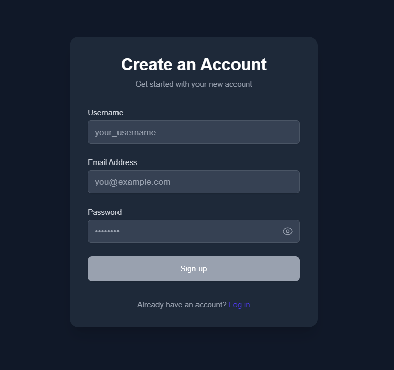
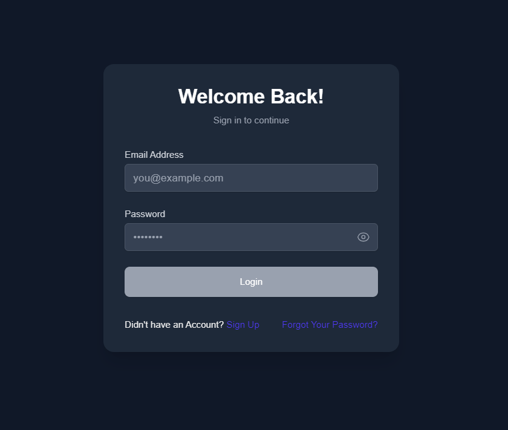
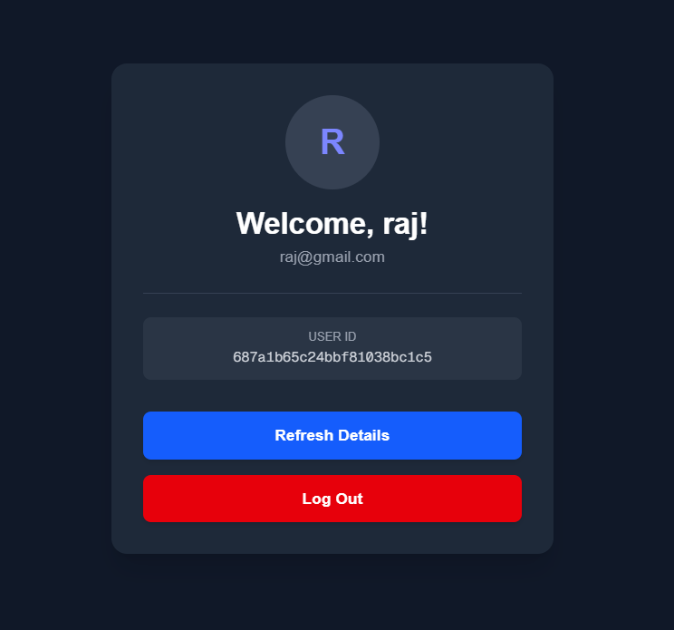
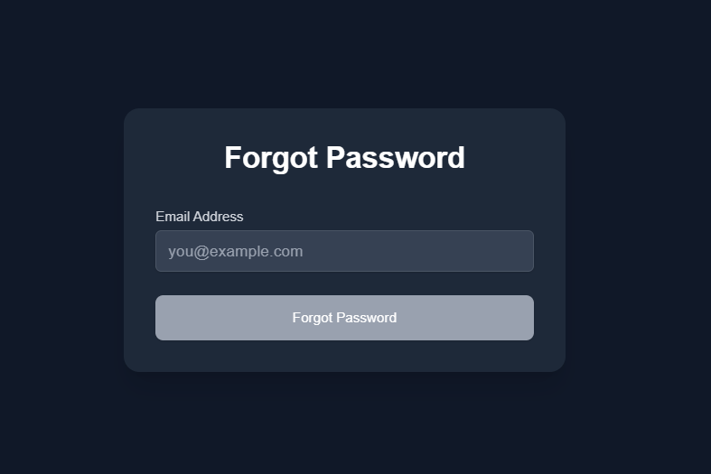
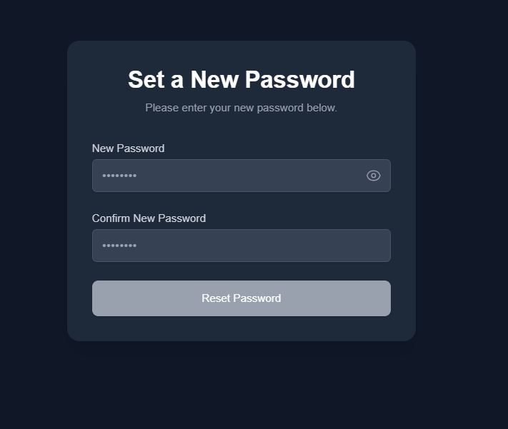
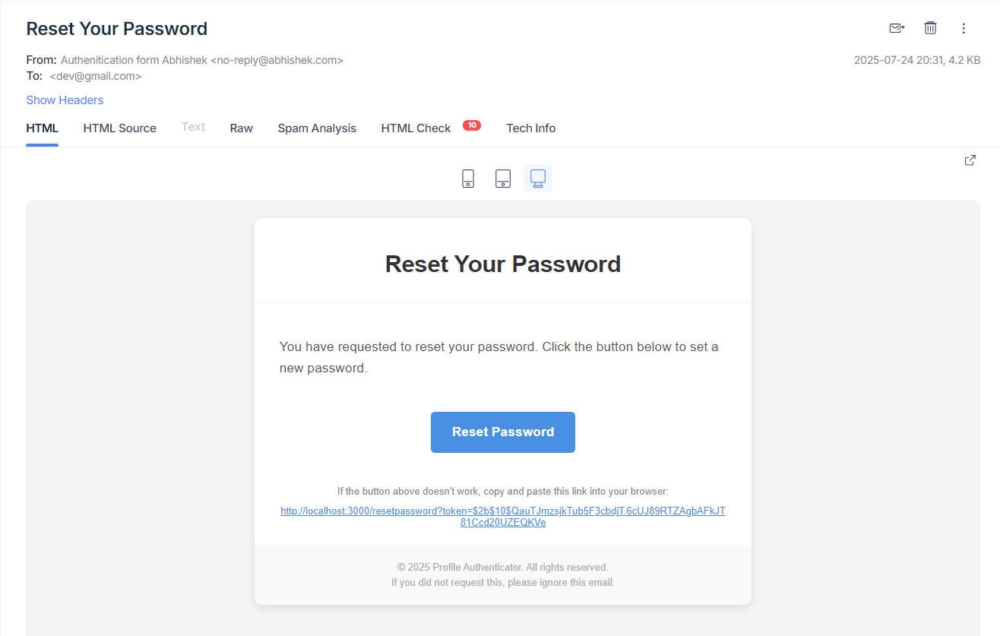
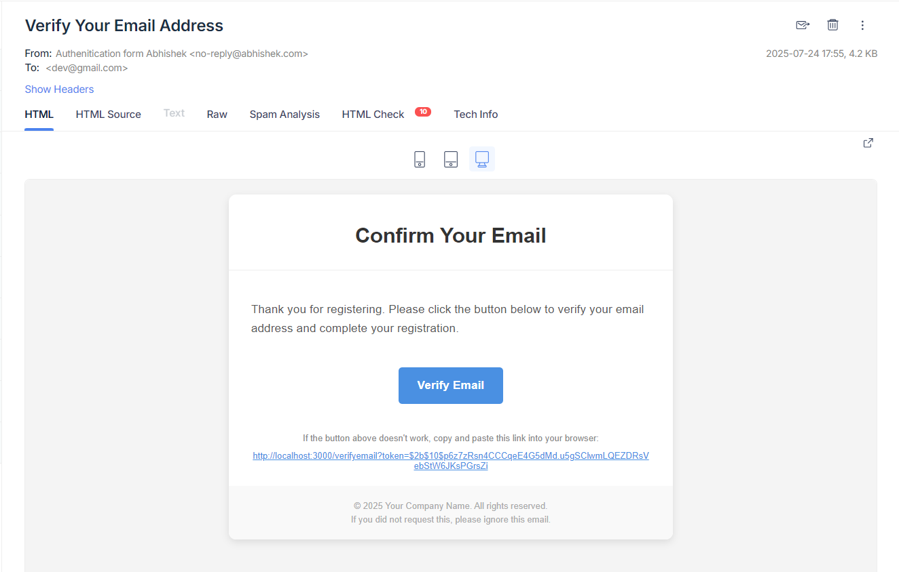

# Next.js Authentication Project

This is a modern Next.js project demonstrating a complete user authentication flow including MongoDB database, signup, login, profile management, password reset, and email verification.

---

## Table of Contents
- [Getting Started](#getting-started)  
- [Features](#features)  
- [Project Structure](#project-structure)  
- [Pages Overview](#pages-overview)  
- [Email Integration](#email-integration)  
- [Usage](#usage)  
- [Screenshots](#screenshots)  
- [Learn More](#learn-more)  
- [Deployment](#deployment)  

---

## Getting Started

To add for the package from package.json

```bash
npm i
```

To run the development server:

```bash
npm run dev
```

Open [http://localhost:3000](http://localhost:3000) in your browser to view the app.

---

## Features

- User Signup with email verification  
- User Login and session management  
- Profile page with user details  
- Forgot password and reset password functionality  
- Email notifications for verification and password reset using Mailtrap  
- Secure token-based password reset links  

---

## Project Structure

- `src/app/` - Contains all the Next.js app routes and pages  
- `src/app/api/users/` - API routes for user authentication and management  
- `src/models/` - User model and database schema using MongoDB and Mongoose  
- `src/helpers/` - Helper functions including mailer integration  
- `src/middleware.ts` - Middleware for route protection and validation  

---

## Database

This project uses **MongoDB** as the database and **Mongoose** as the ODM (Object Data Modeling) library to define schemas and interact with MongoDB.

You can view and manage your MongoDB data using tools like [MongoDB Compass](https://www.mongodb.com/products/compass).

### Example MongoDB Data View


---

## Pages Overview

- **Sign In** - User registration page  
- **Login** - User login page  
- **Profile** - User profile management page  
- **Forgot Password** - Request password reset link  
- **Reset Password** - Set a new password using a secure token  
- **Email Verification** - Verify user email after signup  

---

## Email Integration

This project uses [Mailtrap](https://mailtrap.io) for capturing and testing emails during development. Due to domain and DNS permission constraints required for sending real emails, this project uses Mailtrap's sandbox environment for email testing.

It handles:

- Verification emails after signup  
- Password reset emails with secure token links  

---

## Usage

1. Signup a new user on the Sign In page.  
2. Check Mailtrap inbox for verification email and verify your account.  
3. Login with verified credentials.  
4. Access your profile page.  
5. Use Forgot Password page to request a password reset link.  
6. Use the Reset Password page accessed via the emailed token link to set a new password.  

---

## Screenshots

### Sign In Page  


### Login Page  


### Profile Page  


### Forgot Password Page  


### Reset Password Page  


### Mailtrap Email Example  
#### Reset Password Mail


#### Verify User Mail


---

## Learn More

- [Next.js Documentation](https://nextjs.org/docs)  
- [Next.js Learn](https://nextjs.org/learn)  
- [Mailtrap Documentation](https://api-docs.mailtrap.io/docs/mailtrap-api-docs/5tjdeg9545058-mailtrap-api)  

---

## Deployment

The easiest way to deploy this Next.js app is using [Vercel](https://vercel.com). See [Next.js deployment docs](https://nextjs.org/docs/app/building-your-application/deploying) for details.

---

Feel free to contribute or raise issues on the GitHub repository.
